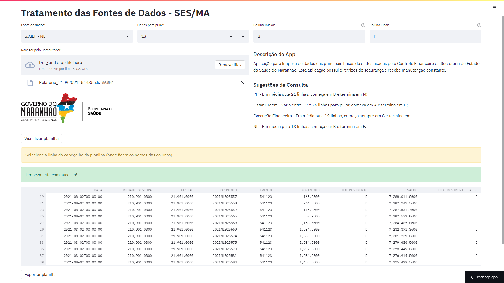

# Tratamento das Fontes de Dados - SES/MA

Limpeza de Bases de Dados usadas pelo Controle Financeiro da Secretaria de Estado da Saúde do Maranhão.

[Tratamento das Fontes de Dados da SES](https://sigef-sesma-tratamento.streamlit.app/)

Layout:

## Updates

#### Versão 0.0.0

1. Adicionar FNS (Feito)
2. Adicionar tabela auxiliar Subação e Complemento (Feito)
3. Adicionar SIGEF Execução Orçamentária (Feito)
4. Adicionar SIGEF Ordem Bancária (Feito)
5. Adicionar HELP (Feito)

#### Versão 0.1.1

6. Relacionamentos entre planilhas (Removido)
7. Adicionar NL (Removido)
8. Testes para anos anteriores (Feito)

#### Versão 1.2.2

9. Observações das PPs
10. Número dos Processos e Competência

#### Versão 1.3.2

11. Orçamento

#### Versão 1.4.3

12. Pré-Empenho
13. Pré-Empenho no Empenho
14. Contratos
15. Ação

#### Versão 1.5.3

16. Execução dos Pré-Empenhos

#### Versão 1.6.3

17. Detahar Conta 8.2.1.7.2.01

#### Versão 1.6.4

17. Patch de Notas Empenhos Células - Anos anteriores a 2021

#### Versão 1.6.5

18. Patch de Subações para 2019

#### Versão 1.7.5

19. Imprimir Despesa Certificada Situação (NLs e Processos)
20. Imprimir Liquidação Credor (NLs e NEs)

#### Versão 1.7.6

21. Patch Subação 2023
22. Ordens Bancárias 2023
23. Preparações de Pagamento 2023

#### Versão 1.7.7

24. Detalhar Conta 2023
25. Correção Listar Preparação

#### Versão 1.8.8

26. Relatório de Diárias
27. Novo Patch de Subações
28. Função de Download Multíplas Planilhas

#### Versão 1.9

29. Listar Nota Empenho (Datas)
30. Cota a Empenhar (Execução Financeira)

#### Versão 1.10

31. Balancete Contábil

#### Versão 1.10.1

32. Criação de Chaves Primárias;
33. Correção de bugs no Pagamento Efetuado

#### Versão 1.11

34. Frases Motivacionais

#### Versão 1.12

35. Descentralização

## Conquistas

* Redução no tempo de tratamento de dados para a construção do fluxo de caixa diário;
* Criação mais rápida de Relatórios Gerenciais.

## Comentários

**Lilian (RIP)**: "A aplicação trouxe celeridade à rotina de tratamento das informações que precisam ser atualizadas em tempo real."

**Adriana**: "A aplicação agilizou as tarefas rotineiras e otimizou o tempo para realizar tarefas mais complexas e desafiadoras."

**Guilherme**: "A aplicação otimizou meu tempo de trabalho que antes era dedicado a resolução de tarefas que poderiam ser automatizadas."

**Vinicius**: "Não altera nada nesse código não siô, esse negócio salva meu fluxo todo dia..."
