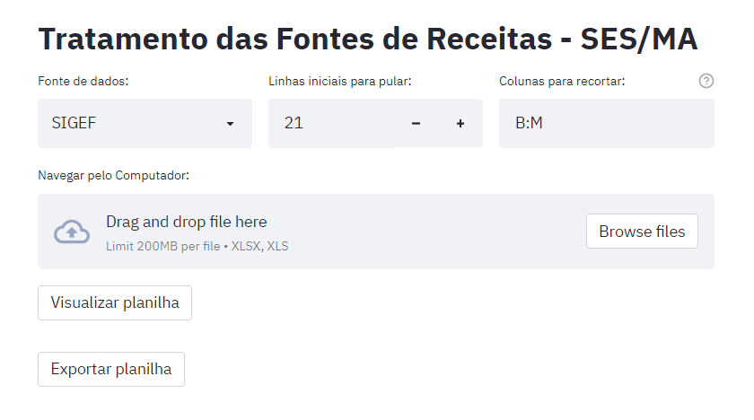

# Tratamento das Fontes de Receitas - SES/MA

Limpeza de Bases de Dados usadas pelo Controle Financeiro da Secretaria de Estado da Saúde do Maranhão.

Layout:

## Updates

1. Adicionar FNS Custeio (Feito)
2. Adicionar tabela auxiliar Subação e Complemento (Feito)
3. Adicionar SIGEF Execução Orçamentária (Feito)
4. Relacionamentos entre planilhas (Feito)
5. Adicionar SIGEF Ordem Bancária (Feito)
6. Adicionar HELP (Feito)